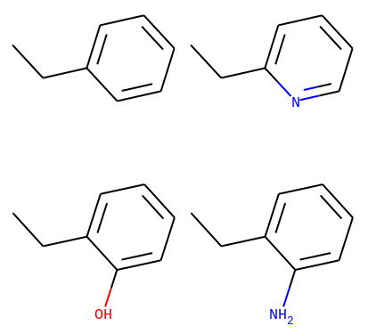

# Computer Aided Drug Design (CADD) Project

This repository contains my explorations in computational drug discovery!

- Bioinformatics excercise to search for drug-like molecules following the rule-of-five
- Generative NLP modeling for SMILES token-level prediction task
- Classic ML for SMILES autocompletion using Trie data structure

(Author: Samira Pakravan, spakravan@ucsb.edu)
